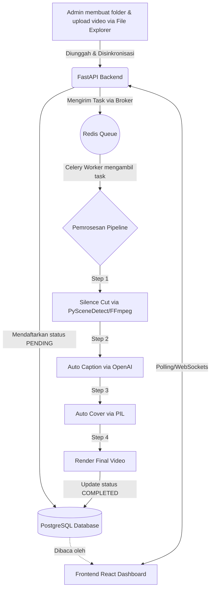
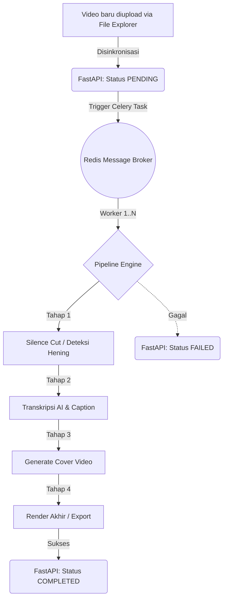
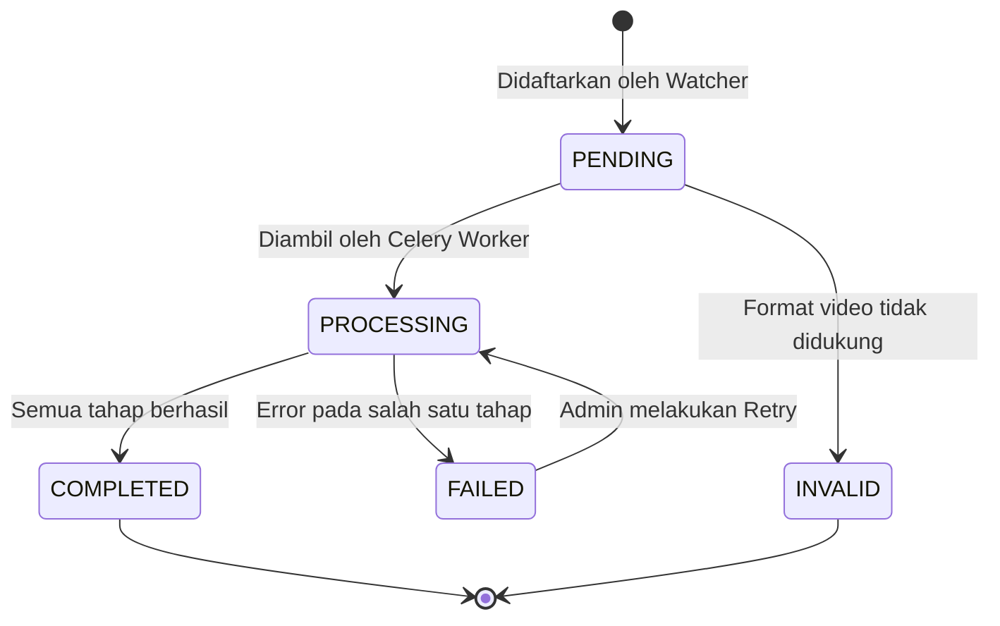
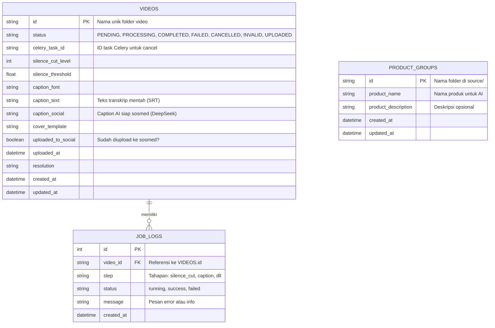

# PRD: Sistem Otomatisasi Edit Video Harian

## Document Control

| Field | Detail |
|---|---|
| Nama Produk | **Vidflow Studio** — Automated affiliate video editing with streamlined workflow automation |
| Versi Dokumen | 1.0 |
| Tanggal | 20 Juni 2026 |
| Status | Draft — siap dipakai sebagai acuan development |
| Author | _(nama kamu)_ |
| Tipe Deploy | Local (MVP) → Server Online (fase lanjutan) |

---

## Daftar Isi

1. [Ringkasan Eksekutif](#1-ringkasan-eksekutif)
2. [Latar Belakang & Masalah](#2-latar-belakang--masalah)
3. [Tujuan Produk & Success Metrics](#3-tujuan-produk--success-metrics)
4. [Target Pengguna](#4-target-pengguna)
5. [Lingkup Produk](#5-lingkup-produk)
6. [User Stories & Acceptance Criteria](#6-user-stories--acceptance-criteria)
7. [Functional Requirements](#7-functional-requirements)
8. [Non-Functional Requirements](#8-non-functional-requirements)
9. [Arsitektur Sistem](#9-arsitektur-sistem)
10. [Alur Pemrosesan Video (Pipeline)](#10-alur-pemrosesan-video-pipeline)
11. [Job State Machine](#11-job-state-machine)
12. [Skema Database](#12-skema-database)
13. [Rancangan API Endpoint](#13-rancangan-api-endpoint)
14. [Desain Admin Dashboard per Halaman](#14-desain-admin-dashboard-per-halaman)
15. [Tech Stack & Justifikasi](#15-tech-stack--justifikasi)
16. [Integrasi Layanan Eksternal](#16-integrasi-layanan-eksternal)
17. [Konvensi Folder & Penamaan](#17-konvensi-folder--penamaan)
18. [Estimasi Biaya Operasional](#18-estimasi-biaya-operasional)
19. [Keamanan & Pengelolaan Akses](#19-keamanan--pengelolaan-akses)
20. [Roadmap & Milestone](#20-roadmap--milestone)
21. [Risiko & Mitigasi](#21-risiko--mitigasi)
22. [Asumsi & Ketergantungan](#22-asumsi--ketergantungan)
23. [Pertanyaan Terbuka](#23-pertanyaan-terbuka)
24. [Glosarium](#24-glosarium)

---

## 1. Ringkasan Eksekutif

Aplikasi web-based dengan **admin panel** sebagai pusat kendali untuk mengotomatisasi pipeline edit video harian yang sifatnya repetitif: memotong bagian sepi, menambahkan caption otomatis, menambahkan cover, dan merender ke resolusi final. Sumber video mentah ditaruh manual oleh admin ke dalam folder yang diberi nama berupa ID unik; sistem membaca folder tersebut, mendaftarkannya ke database, lalu memprosesnya secara otomatis sesuai konfigurasi yang diatur dari dashboard.

Fase awal (MVP) berjalan **local** di laptop admin, dengan rencana migrasi ke **server online** begitu pipeline inti sudah stabil.

---

## 2. Latar Belakang & Masalah

Proses edit video harian saat ini dilakukan manual dan berulang dengan pola yang sama persis setiap hari:
- Memotong bagian video yang tidak ada suara (baik di awal/akhir maupun di tengah)
- Menambahkan caption ke dalam video
- Membuat cover/thumbnail
- Export ke resolusi tertentu

Karena polanya konsisten, pekerjaan ini cocok untuk diotomatisasi. Tanpa otomatisasi, waktu admin habis untuk tugas berulang yang sebenarnya bisa diserahkan ke sistem, sehingga mengurangi waktu untuk hal-hal yang butuh kreativitas atau keputusan manusia.

---

## 3. Tujuan Produk & Success Metrics

| Tujuan | Metrik Keberhasilan (KPI) |
|---|---|
| Mengurangi waktu edit manual per video | Waktu admin per video turun dari (baseline manual) menjadi hanya waktu upload + cek hasil |
| Konsistensi kualitas output | 100% video yang diproses punya caption, cover, dan resolusi sesuai konfigurasi tanpa intervensi manual |
| Sistem bisa diandalkan jalan tanpa diawasi | Job berhasil (success rate) ≥ 95% tanpa perlu retry manual |
| Mudah dikontrol tanpa coding | Semua parameter (threshold silence, style caption, tipe cover, resolusi) bisa diubah dari dashboard tanpa edit kode |
| Siap migrasi ke server online | Deployment local ke server hanya butuh perubahan konfigurasi environment, bukan re-arsitektur |

---

## 4. Target Pengguna

**Persona utama: Admin/Operator (kamu sendiri)**
- Mengelola video harian dalam volume tertentu
- Tidak ingin mengulang langkah edit yang sama setiap hari
- Punya laptop dengan spesifikasi rendah → bergantung pada API cloud untuk proses berat (AI/STT)
- Butuh kontrol penuh atas parameter edit tanpa harus menyentuh kode

Saat ini sistem dirancang **single-admin** (belum ada kebutuhan multi-user/role).

---

## 5. Lingkup Produk

### In-Scope (MVP)
- Folder watcher berbasis ID untuk mendeteksi video mentah baru
- **Silence Cut** Level 1 (trim awal/akhir), Level 2 (hapus silence amplitude), **Level 3 (VAD/AI)** — deteksi suara manusia vs noise pakai AI
- **Auto Caption** (speech-to-text Whisper + burn-in, style diatur dari dashboard)
- **AI Social Caption** — transkrip diolah ulang oleh DeepSeek V4 Flash menjadi caption siap upload sosmed (dengan hashtag, emoji, dan 16 pilihan gaya bahasa)
- **Auto Cover** — 3 template dual-color + **AI-generated judul cover** dari DeepSeek (auto line-wrap, konteks produk)
- **Product Group** — mapping folder → nama produk, AI pakai konteks produk (bukan cuma transkrip)
- Render otomatis ke .mp4 (HD/FHD/4K, codec H.264/H.265/WebM), **sequential processing**
- Admin dashboard: konfigurasi, monitoring job, halaman hasil render, **kelola produk**, log/riwayat
- **Cancel processing**, **batch render**, **video detail modal**

### Out-of-Scope (Fase Berikutnya — belum dirancang detail)
- Fitur tambahan yang belum ditentukan
- Multi-user / role & permission di admin panel
- Auto-publish ke platform sosial media
- Analytics performa video (views, engagement, dsb.)
- Preview/editing manual di dalam aplikasi (saat ini murni otomatis end-to-end)

---

## 6. User Stories & Acceptance Criteria

| ID | User Story | Acceptance Criteria |
|---|---|---|
| US-1 | Sebagai admin, saya ingin menaruh video mentah di folder ber-ID dan sistem otomatis mendaftarkannya, supaya saya tidak perlu input manual ke sistem. | Folder baru terdeteksi ≤ 1 menit setelah dibuat; ID & path tersimpan di database dengan status `pending`. |
| US-2 | Sebagai admin, saya ingin memilih level silence-cut secara global atau per video, supaya saya bisa menyesuaikan kebutuhan tiap konten. | Pilihan level tersimpan dan diterapkan saat job dijalankan; ada opsi override per video. |
| US-3 | Sebagai admin, saya ingin mengatur tampilan caption (font, ukuran, posisi, warna) dari dashboard, supaya saya tidak perlu edit kode untuk ganti gaya. | Perubahan setting langsung dipakai oleh job berikutnya tanpa redeploy. |
| US-4 | Sebagai admin, saya ingin cover otomatis dibuat sesuai template pilihan saya, supaya video siap pakai tanpa desain manual. | Cover ter-generate dan tersimpan terhubung ke video terkait. |
| US-5 | Sebagai admin, saya ingin memilih resolusi output (HD/FHD/4K), supaya hasil render sesuai kebutuhan platform tujuan. | File output sesuai resolusi yang dipilih, terverifikasi dari metadata video. |
| US-6 | Sebagai admin, saya ingin melihat status semua video (antrian/diproses/selesai/gagal) di satu halaman, supaya saya bisa memantau tanpa cek manual per file. | Dashboard menampilkan status real-time/polling untuk seluruh video aktif. |
| US-7 | Sebagai admin, saya ingin job yang gagal bisa di-retry dari dashboard, supaya saya tidak perlu trigger ulang lewat command line. | Tombol retry tersedia di UI dan job berjalan ulang dari step yang gagal. |

---

## 7. Functional Requirements

### 7.1 FR1 — Manajemen Folder & ID Video

- Sistem memindai folder sumber secara berkala (atau via filesystem event watcher) untuk mendeteksi subfolder baru.
- Nama subfolder dipakai langsung sebagai **ID unik** video di database.
- Jika ID sudah ada di database, folder tidak didaftarkan ulang (mencegah duplikasi).
- Status awal video setelah terdaftar: `pending`.

**Acceptance Criteria:**
- [ ] Folder baru terdeteksi otomatis tanpa restart aplikasi
- [ ] Duplikasi ID ditangani tanpa error/crash
- [ ] Video dengan format tidak didukung diberi status `invalid` beserta alasan di log

### 7.2 FR2 — Silence Detection & Cut

**Deskripsi:** Sistem mendeteksi bagian video tanpa suara berdasarkan analisis spektrum audio, dengan dua level pemrosesan yang dapat dipilih admin.

**FR2.1 — Level 1: Trim Awal & Akhir**
- Mendeteksi durasi diam di awal (sebelum suara pertama) dan akhir (setelah suara terakhir) video, lalu memotongnya.
- Bagian tengah video tidak disentuh meskipun ada jeda diam.

**FR2.2 — Level 2: Hapus Silence di Tengah**
- Memindai seluruh durasi video, mendeteksi semua segmen diam, menghapusnya, dan menyambung ulang segmen-segmen bersuara.
- Menyisakan padding kecil di awal/akhir tiap segmen yang dipertahankan agar potongan tidak terdengar kasar.

**Parameter yang dapat diatur dari dashboard:**

| Parameter | Default (saran awal) | Keterangan |
|---|---|---|
| Threshold dB | -30 dB | Ambang batas dianggap "diam" |
| Durasi minimum diam dipotong | 0.3 detik | Diam lebih pendek dari ini diabaikan |
| Padding segmen (khusus Level 2) | 150 ms | Buffer di awal/akhir tiap segmen bersuara |

**Acceptance Criteria:**
- [ ] Admin bisa memilih: nonaktif / Level 1 / Level 2, secara global maupun override per video
- [ ] Potongan tidak memotong audio di tengah kata yang sedang diucapkan
- [ ] Total durasi yang dipotong tercatat di log job

### 7.3 FR3 — Auto Caption

- Audio video dikirim ke layanan Speech-to-Text untuk transkripsi dengan **word-level timestamp**.
- Transkrip dikonversi menjadi file subtitle format ASS (mendukung styling detail).
- Caption di-burn langsung ke video menggunakan FFmpeg.

**Parameter yang dapat diatur dari dashboard:**

| Parameter | Opsi |
|---|---|
| Jenis font | Dropdown daftar font tersedia (font native Linux) |
| Ukuran font | Slider/numerik (5px - 50px) |
| Posisi | Slider Persentase 0-100% (berbasis MarginV virtual 288px) |
| Warna teks & outline | Color picker |
| Style | Normal / highlight kata aktif (karaoke-style, ala CapCut) |

**Acceptance Criteria:**
- [ ] Caption tersinkron dengan audio (toleransi maksimum sekian milidetik — ditentukan saat testing)
- [ ] Perubahan style di dashboard berlaku untuk job berikutnya tanpa perlu deploy ulang
- [ ] Video tanpa suara terdeteksi (silent) tidak memaksa proses captioning gagal — sistem skip dengan status jelas

### 7.4 FR4 — Auto Cover

- Sistem memilih frame representatif dari video (misal berdasarkan scene detection) sebagai dasar cover.
- Cover disusun dengan template yang dipilih admin (posisi judul/teks, elemen dekoratif, watermark/logo opsional).

**Acceptance Criteria:**
- [ ] Cover tersimpan dan terhubung ke video terkait di database
- [ ] Admin dapat memilih minimal 1 template di MVP, dengan struktur yang memungkinkan penambahan template baru ke depan

### 7.5 FR5 — Render & Export

- Hasil akhir di-render ke format `.mp4` dengan resolusi sesuai pilihan admin: HD (720p) / FHD (1080p) / 4K (2160p).
- Encoding settings (codec, bitrate) memakai default yang wajar, dengan opsi advanced di fase lanjutan.

**Acceptance Criteria:**
- [ ] Resolusi output sesuai pilihan, terverifikasi dari metadata file
- [ ] File final tersimpan di folder output dengan penamaan yang konsisten (lihat [Bagian 17](#17-konvensi-folder--penamaan))

### 7.6 FR6 — Admin Dashboard & Job Control

- Dashboard menampilkan status seluruh video & job (lihat detail di [Bagian 14](#14-desain-admin-dashboard-per-halaman)).
- Admin dapat trigger job manual, retry job gagal, dan mengubah seluruh parameter di atas tanpa menyentuh kode.

### 7.7 FR7 — VAD/AI Speech Detection (Level 3)

**Deskripsi:** Menggantikan silence detection berbasis amplitudo dengan **Voice Activity Detection (VAD)** berbasis AI yang membedakan suara manusia vs noise (kipas, kendaraan, bayi nangis).

- Menggunakan **Silero VAD** (PyTorch, 1.6MB model) yang berjalan lokal di CPU.
- Hanya segmen video dengan suara manusia yang dipertahankan; noise & hening otomatis dibuang.
- Tersedia sebagai **Level 3** di halaman Silence Cut Configuration.

**Parameter:**

| Parameter | Default | Keterangan |
|---|---|---|
| Speech Threshold | 0.5 | Probabilitas minimum suara manusia (0-1). Lebih tinggi = lebih strict |
| Padding | 200 ms | Buffer sebelum/sesudah segmen suara |

**Acceptance Criteria:**
- [ ] Suara non-manusia (kipas, kendaraan) terdeteksi sebagai noise & dihapus
- [ ] Suara manusia tetap dipertahankan (>90% akurasi)

### 7.8 FR8 — AI Social Media Caption

**Deskripsi:** Hasil transkrip Whisper (.SRT) diolah ulang oleh **DeepSeek V4 Flash** untuk menghasilkan caption siap upload sosial media.

- Caption AI mencakup: teks engaging + emoji + hashtag.
- Tersedia **16 gaya bahasa** (Gen-Z, Hard Selling, Storytelling, Edukasi, Savage, dll).
- **Konteks produk:** AI menggunakan nama produk dari ProductGroup sebagai fokus utama caption (bukan cuma transkrip).
- Caption bisa digenerate **on-demand** dari halaman Hasil Render tanpa proses ulang video.
- Parameter (max kata, jumlah hashtag, gaya) dikonfigurasi di halaman **Auto Caption**.

**Parameter:**

| Parameter | Default | Keterangan |
|---|---|---|
| Maksimum Kata | 40 | Kata dalam caption utama |
| Jumlah Hashtag | 5 | 0 = tanpa hashtag |
| Gaya Bahasa | Santai & Gaul (Gen-Z) | 16 pilihan gaya |

### 7.9 FR9 — AI Cover Title Generation

**Deskripsi:** Judul cover video digenerate otomatis oleh **DeepSeek V4 Flash** dari transkrip, menggantikan input manual.

- Judul pendek (default 7 kata, maks 12) agar muat di cover.
- **Auto line-wrap + auto-font** — teks turun ke baris baru + font mengecil jika melebihi lebar gambar.
- **Konteks produk:** AI menggunakan nama produk dari ProductGroup, transkrip hanya sebagai pelengkap.
- 16 gaya bahasa (sama dengan caption AI).

**Parameter:**

| Parameter | Default | Keterangan |
|---|---|---|
| Gaya Bahasa Judul | Santai & Gaul (Gen-Z) | 16 pilihan |
| Maksimum Kata Judul | 7 | 3-12 kata |

---

## 8. Non-Functional Requirements

| Kategori | Requirement |
|---|---|
| Performa | Satu video durasi ≤ 10 menit selesai diproses penuh (silence cut → caption → cover → render) dalam waktu wajar sesuai kapasitas hardware; target spesifik ditentukan setelah benchmark awal |
| Reliabilitas | Job yang gagal di satu step tidak menghapus progres step sebelumnya; bisa di-retry dari step yang gagal saja |
| Skalabilitas | Arsitektur job queue memungkinkan penambahan worker tanpa mengubah kode utama (relevan saat migrasi ke server) |
| Portabilitas | MVP local menggunakan service native (PostgreSQL, Redis) dengan startup scripts. Migrasi ke server akan menggunakan Docker untuk transisi tanpa setup ulang |
| Maintainability | Parameter pipeline (threshold, style, dsb.) disimpan di database/config, bukan hardcoded |
| Observability | Setiap job punya log step-by-step yang bisa ditelusuri saat terjadi error |

---

## 9. Arsitektur Sistem

**Deskripsi komponen:**

| Komponen | Tanggung Jawab |
|---|---|
| Folder Watcher | Mendeteksi folder ID baru, mendaftarkan video ke database |
| Database (PostgreSQL) | Menyimpan data video, job, dan konfigurasi (native service, port 5432) |
| Admin Dashboard | UI untuk konfigurasi, trigger job, monitoring |
| Job Queue (Celery + Redis) | Mengantre & mendistribusikan pekerjaan berat ke worker secara async (Redis native service, port 6379) |
| Worker | Menjalankan pipeline pemrosesan video tahap demi tahap |
| Output Folder | Lokasi penyimpanan hasil akhir .mp4 |
| Startup Scripts | `start-all.sh` / `stop-all.sh` (WSL) + Windows Desktop `.bat` launchers untuk one-click operation |

---

## 10. Alur Pemrosesan Video (Pipeline)

---

## 11. Job State Machine

---

## 12. Skema Database

---

## 13. Rancangan API Endpoint

| Method | Endpoint | Deskripsi |
|---|---|---|
| GET | `/api/videos` | List semua video beserta status |
| GET | `/api/videos/{id}` | Detail video tertentu termasuk riwayat job |
| POST | `/api/videos/sync` | Trigger scan folder secara manual |
| POST | `/api/videos/{id}/process` | Trigger pipeline job untuk video tertentu |
| POST | `/api/videos/{id}/cancel` | Batalkan pipeline yang sedang berjalan |
| GET | `/api/groups` | List semua grup produk |
| PUT | `/api/groups/{id}` | Update nama & deskripsi produk |
| POST | `/api/groups/sync` | Sinkronisasi folder source ke grup produk |
| GET | `/api/jobs/{job_id}` | Cek status job tertentu |
| POST | `/api/jobs/{job_id}/retry` | Retry job yang gagal |
| GET | `/api/settings` | Ambil seluruh setting global |
| PUT | `/api/settings` | Update setting global |
| GET | `/api/settings/{video_id}` | Ambil override setting per video |
| PUT | `/api/settings/{video_id}` | Update override setting per video |
| GET | `/api/logs` | Ambil log/histori proses (dengan filter tanggal & status) |
| GET | `/api/outputs` | List video completed dengan file output |
| GET | `/api/outputs/{id}/caption` | Ambil teks transkrip (plain/SRT) |
| GET | `/api/outputs/{id}/social-caption` | Ambil/generate caption AI sosmed |
| GET | `/api/outputs/{id}/download` | Download file output video |
| PATCH | `/api/outputs/{id}/toggle-uploaded` | Toggle status upload sosmed |
| DELETE | `/api/outputs/{id}` | Hapus video + semua file terkait |
| PUT | `/api/settings` | Update API keys (OpenAI + DeepSeek) |

---

## 14. Desain Admin Dashboard per Halaman

**Overview/Dashboard**
- Card ringkasan: total video, job aktif, job gagal hari ini, job selesai hari ini
- Tabel job terbaru: ID video, step saat ini, status, waktu mulai

**File Explorer (Manajemen Sumber)**
- GUI mirip Google Drive / Windows Explorer terintegrasi di dalam browser.
- Mendukung Drag & Drop, klik kanan (Context Menu solid background), seleksi multiple (CTRL+klik), dan double-click untuk membuka folder.
- Dukungan interaksi *mobile/smartphone* (opsi checkbox & tombol tiga titik untuk touch interface).
- Fungsi CRUD (Create, Rename, Delete, Upload file) langsung dari UI tanpa harus membuka folder laptop.

**Kelola Produk**
- Card grid: mapping folder ID → nama produk & deskripsi
- Input inline + tombol Simpan, Sync Folder dari source/
- AI caption & cover akan menggunakan konteks produk ini

**Daftar Video**
- Tabel: checkbox multi-select, ID, tanggal, status, tombol aksi (Proses / Stop / Detail / Hapus)
- Select All + Batch Render: tombol "Render N Video" untuk memproses banyak video
- Video Detail Modal (`...`): info lengkap + riwayat job log per step
- Cancel Processing: tombol Stop untuk batalkan pipeline yang sedang berjalan
- Filter: status, tanggal masuk

**Hasil Render**
- Tabel video yang sudah COMPLETED: preview/cover, ID, caption AI (tombol Salin), download, toggle upload sosmed, hapus
- Filter: Upload Sosmed (Semua / Sudah / Belum)
- Pagination: 20 data per halaman
- Video player pop-up (klik cover untuk preview)

**Konfigurasi Silence Cut**
- Toggle: Nonaktif / Level 1 / Level 2 / **Level 3 (VAD/AI)**
- Level 3: deteksi suara manusia vs noise pakai Silero VAD
- Input: threshold dB, durasi minimum diam, padding, VAD speech threshold

**Konfigurasi Caption**
- Dropdown jenis font, slider ukuran font (5-50px)
- Color picker warna teks & outline, toggle outline + ketebalan
- Slider posisi vertikal (0-100%, MarginV virtual 288px)
- **Section AI Caption Sosmed:** max kata, jumlah hashtag, 16 gaya bahasa

**Konfigurasi Cover**
- Pilihan template (3 template dual-color + Blank Cover dengan preview)
- Template: Kuning-Putih, Hijau-Putih, Merah-Putih — 25 karakter/baris, dual-color
- Slider max kata judul 3-12 (default 7)
- **AI Generate Judul:** 16 gaya bahasa + konteks produk (DeepSeek)

**Konfigurasi Render**
- Dropdown resolusi: HD / FHD / 4K
- Dropdown format output
- Pengaturan bitrate (advanced, opsional)

**Log & Riwayat**
- Tabel log per job: timestamp, video ID, step, status, pesan error
- Filter berdasarkan tanggal & status

---

## 15. Tech Stack & Justifikasi

| Layer | Teknologi | Alasan |
|---|---|---|
| Backend API | Python + FastAPI | Async, ekosistem kaya untuk audio/video processing |
| Job Queue | Celery + Redis | Memisahkan proses berat dari request HTTP, mudah ditambah worker |
| Database | PostgreSQL | Migrasi local → server tinggal ganti connection string |
| Frontend Admin | React / Next.js | Cocok untuk dashboard interaktif (slider, color picker, dsb.) |
| Video Engine | FFmpeg | Standar industri untuk cut, burn subtitle, render |
| Folder Watcher | Python `watchdog` | Deteksi perubahan filesystem real-time |
| Cover Generation | PySceneDetect + Pillow/OpenCV | Scene detection + compositing gambar + auto text-wrap |
| VAD (Speech Detection) | Silero VAD (PyTorch) | Deteksi suara manusia vs noise, jalan lokal CPU |
| AI Caption & Cover Title | DeepSeek V4 Flash API | Generate caption sosmed + judul cover dari transkrip |
| Deployment (MVP Local) | Native WSL services + Shell scripts | PostgreSQL & Redis sebagai service native; `start-all.sh` untuk one-click startup |
| Deployment (Server Online) | Docker + Docker Compose | Untuk fase migrasi ke server (Fase 6) |

---

## 16. Integrasi Layanan Eksternal

**Speech-to-Text (untuk Auto Caption)** — diputuskan pakai layanan cloud berbayar karena spek laptop rendah:

| Layanan | Estimasi Harga | Catatan |
|---|---|---|
| OpenAI API (`whisper-1`) | ~$0.006/menit | Pilihan eksklusif (Deepgram ditiadakan): Cepat, akurat, satu tagihan, ada dukungan output SRT/VTT yang mudah diolah. |

**AI Caption & Cover Title (DeepSeek V4 Flash)** — untuk generate caption sosmed + judul cover:

| Model | Harga (per 1M token) | Catatan |
|---|---|---|
| DeepSeek V4 Flash | $0.14 input / $0.28 output | OpenAI-compatible, reasoning mode bisa dinonaktifkan |

> API keys dikelola dari halaman **Global Settings & API Keys** di dashboard. DeepSeek digunakan untuk 2 fitur: caption sosial media & judul cover otomatis.

---

## 17. Konvensi Folder & Penamaan

- Folder sumber: `/source/{video_id}/` — nama folder = ID unik video
- Folder output: `/output/{video_id}/{video_id}_{resolution}.mp4`
- File cover: `/output/{video_id}/{video_id}_cover.jpg`
- File subtitle intermediate: `/tmp/{video_id}/{video_id}.ass`

---

## 18. Estimasi Biaya Operasional

**Asumsi:** 10 video/hari, rata-rata durasi 5 menit/video → 50 menit audio/hari ≈ 1.500 menit/bulan.

| Komponen | Estimasi Biaya/Bulan |
|---|---|
| STT — OpenAI `whisper-1` | ~$9 |
| AI Caption + Cover — DeepSeek V4 Flash | ~$0.50–1 |
| **Total estimasi (MVP, tanpa server online)** | **~$10–13/bulan** |

> DeepSeek V4 Flash sangat murah ($0.14/M input, $0.28/M output). Per video (~200 token output untuk caption + ~20 token untuk judul cover) hanya perlu ~$0.001.

---

## 19. Keamanan & Pengelolaan Akses

- Autentikasi admin dashboard (minimal username/password + session/JWT)
- API key layanan eksternal (STT/LLM) disimpan di environment variable, tidak hardcoded di kode
- Saat migrasi ke server online: wajib HTTPS, rate limiting di endpoint admin, backup database berkala

---

## 20. Roadmap & Milestone

> Estimasi waktu hanya patokan kasar — sesuaikan dengan waktu luang sebagai solo developer.

| Fase | Target Waktu | Output |
|---|---|---|
| Fase 0 — Setup | Minggu 1–2 | Struktur repo, schema DB awal, base Docker |
| Fase 1 — Core Pipeline | Minggu 3–5 | Folder watcher, job queue, silence cut Level 1 & 2 |
| Fase 2 — Auto Caption | Minggu 6–7 | Integrasi STT API, generate ASS, burn caption + kontrol admin |
| Fase 3 — Auto Cover | Minggu 8 | Generate cover + AI judul (DeepSeek) + konfigurasi admin |
| Fase 4 — Render & Dashboard Lengkap | Minggu 9–10 | Render multi-resolusi multi-codec, dashboard monitoring + halaman hasil render |
| Fase 5 — Testing & Enhancement | Minggu 11–12 | E2E testing, VAD AI, AI caption sosmed, Windows launcher |
| Fase 6 — Migrasi Server Online | Menyusul | Setup VPS/cloud, CI/CD, monitoring produksi |

---

## 21. Risiko & Mitigasi

| Risiko | Dampak | Kemungkinan | Mitigasi |
|---|---|---|---|
| Render 4K berat di laptop spek rendah | Proses lambat, bottleneck harian | Tinggi | Hardware encoding (NVENC/QSV) bila tersedia; pertimbangkan percepat migrasi ke server untuk volume tinggi |
| Biaya API naik seiring volume | Biaya operasional membengkak | Sedang | Monitoring usage rutin, set budget alert di provider |
| Akurasi caption rendah karena audio noisy | Caption perlu koreksi manual, mengurangi manfaat otomatisasi | Sedang | Uji kualitas STT dengan sampel audio asli sebelum full rollout |
| Frame cover otomatis tidak representatif | Cover kurang menarik/asal | Sedang | Iterasi logic scene detection, sediakan opsi override manual di fase lanjutan |
| Job gagal di tengah pipeline | Video tidak selesai diproses tanpa diketahui | Rendah-Sedang | State machine dengan retry + notifikasi status gagal di dashboard |

---

## 22. Asumsi & Ketergantungan

- Video sumber sudah dalam format umum yang didukung FFmpeg (mp4/mov/mkv)
- Nama folder/ID bersifat unik dan tidak diubah setelah video didaftarkan
- Koneksi internet stabil untuk panggilan API STT/LLM
- Admin bertanggung jawab menaruh video mentah secara manual ke folder sumber (di luar scope otomatisasi MVP)

---

## 23. Pertanyaan Terbuka

- Nama final aplikasi?
- Provider hosting untuk fase server online (VPS biasa, cloud provider tertentu)?
- Apakah suatu saat butuh multi-user/role, atau tetap single-admin selamanya?
- Berapa lama retention policy untuk file output & file mentah setelah diproses?
- Apakah notifikasi (email/Telegram) dibutuhkan saat job gagal, atau cukup dashboard saja?

---

## 24. Glosarium

| Istilah | Penjelasan |
|---|---|
| FFmpeg | Tools open-source untuk memproses audio/video (cut, encode, burn subtitle, dsb.) |
| STT (Speech-to-Text) | Proses mengubah audio ucapan menjadi teks |
| ASS Subtitle | Format file subtitle yang mendukung styling detail (posisi, font, warna, animasi) |
| Job Queue | Sistem antrian untuk memproses pekerjaan berat secara asinkron di background |
| Silence Threshold (dB) | Ambang batas volume yang dianggap "diam" oleh sistem deteksi suara |
| Word-level Timestamp | Penanda waktu mulai & selesai untuk tiap kata hasil transkripsi, dipakai untuk caption gaya karaoke |
