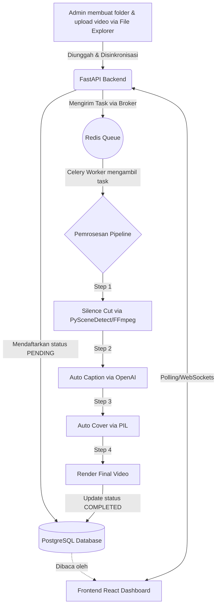

# 📈 Progress Proyek: Auto Video Editor

Dokumen ini melacak status pengembangan aplikasi **Auto Video Editor** berdasarkan PRD (*Product Requirements Document*).

## 📊 Status Keseluruhan
- **Fase Saat Ini:** Fase 4 & 5 (Render Multi-resolusi & Testing E2E Lokal) - **Selesai (MVP Lokal Siap)**
- **Fase Berikutnya:** Fase 6 (Migrasi Server Online)

---

## ✅ Pencapaian (Selesai)
- [x] Inisialisasi struktur *microservices* (Frontend Vite, Backend FastAPI).
- [x] Konfigurasi Docker Compose untuk PostgreSQL dan Redis.
- [x] Desain dan Migrasi Skema Database via SQLAlchemy.
- [x] Pembuatan integrasi Celery Worker untuk pemrosesan asinkron.
- [x] Script `watcher.py` untuk mendeteksi folder video baru secara otomatis.
- [x] Update penggunaan SDK **OpenAI whisper-1** dan **PySceneDetect v0.6+**.
- [x] Keputusan Arsitektur: Resmi menggunakan **OpenAI API (`whisper-1`)** secara eksklusif sebagai penyedia tunggal layanan kecerdasan buatan (transkripsi / caption). Deepgram sepenuhnya dihapus dari ekosistem proyek ini untuk mengefisienkan tagihan (single billing) dan keamanan konfigurasi.
- [x] Pembuatan skrip Integration Test (`test_pipeline.py`) untuk memvalidasi aliran data.
- [x] Dokumentasi Lengkap (`README.md`).

---

- [x] *Image generation* untuk cover video dinamis menggunakan PIL (Selesai, 4 template diimplementasikan).
- [x] Render multi-resolusi (720p, 1080p, 4K) dengan *aspect-ratio aware scaling* terintegrasi.
- [x] End-to-end integration test (`test_pipeline.py`) berjalan sukses dari Database -> API -> Celery Pipeline.
- [x] Pembuatan In-Browser File Explorer: Drag & drop, Context Menu, Multi-select, sinkronisasi otomatis ke Database, desain UI solid dan kompatibilitas sentuh (Mobile friendly).
- [x] Integrasi Background Daemon Lokal: Pembuatan skrip `start.sh` dan `stop.sh` untuk menjalankan seluruh service secara terpusat tanpa banyak jendela terminal.

---

## 🏗️ Dalam Pengerjaan (WIP) / Tertunda
- [ ] Persiapan environment untuk migrasi VPS / Cloud Server Online (Fase 6).

---

## 🗺️ Alur Aplikasi (Flowchart)

Berikut adalah diagram arsitektur dan alur pemrosesan video dari hulu ke hilir:

## 📝 Catatan Teknis
- **PostgreSQL** dialihkan ke port `5433` di dalam Docker untuk menghindari bentrok dengan servis lokal di WSL/Windows.
- Seluruh tugas *backend* dapat ditinjau melalui file logs pada Database (`job_logs`).
