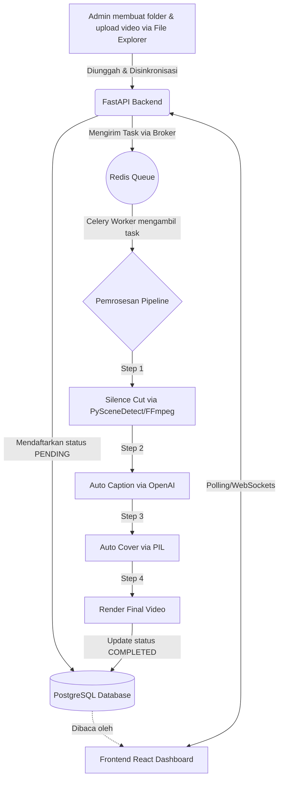

# 📈 Progress Proyek: Auto Video Editor

Dokumen ini melacak status pengembangan aplikasi **Auto Video Editor** berdasarkan PRD (*Product Requirements Document*).

## 📊 Status Keseluruhan
- **Fase Saat Ini:** Fase 4 & 5 (Render Multi-resolusi & Testing E2E Lokal) - **Selesai (MVP Lokal Siap)**
- **Fase Berikutnya:** Fase 6 (Migrasi Server Online)

---

## ✅ Pencapaian (Selesai)

### Fase 0–2: Setup & Core Pipeline
- [x] Inisialisasi struktur *microservices* (Frontend Vite, Backend FastAPI).
- [x] Desain dan Migrasi Skema Database via SQLAlchemy.
- [x] Pembuatan integrasi Celery Worker untuk pemrosesan asinkron.
- [x] Script `watcher.py` untuk mendeteksi folder video baru secara otomatis.
- [x] Update penggunaan SDK **OpenAI whisper-1** dan **PySceneDetect v0.6+**.
- [x] Keputusan Arsitektur: Resmi menggunakan **OpenAI API (`whisper-1`)** secara eksklusif sebagai penyedia tunggal layanan kecerdasan buatan (transkripsi / caption). Deepgram sepenuhnya dihapus dari ekosistem.
- [x] Pembuatan skrip Integration Test (`test_pipeline.py`) untuk memvalidasi aliran data.

### Fase 3–5: Auto Caption, Cover, Render & Dashboard
- [x] *Image generation* untuk cover video dinamis menggunakan PIL (4 template diimplementasikan).
- [x] Render multi-resolusi (720p, 1080p, 4K) dengan *aspect-ratio aware scaling* terintegrasi.
- [x] End-to-end integration test (`test_pipeline.py`) berjalan sukses dari Database → API → Celery Pipeline.
- [x] Pembuatan In-Browser File Explorer: Drag & drop, Context Menu, Multi-select, sinkronisasi otomatis ke Database, desain UI solid dan kompatibilitas sentuh (Mobile friendly).

### Stabilitas & Developer Experience (Juni 2026)
- [x] **Migrasi dari Docker ke Native Services:** PostgreSQL dan Redis sekarang berjalan sebagai service native WSL untuk performa lebih baik dan startup lebih cepat.
- [x] **One-Click Startup:** Pembuatan skrip `start-all.sh` dan `stop-all.sh` — satu perintah untuk menjalankan/mematikan PostgreSQL, Redis, Backend, Celery, dan Frontend.
- [x] **Windows Desktop Launcher:** File `.bat` di Desktop Windows (`Start Video Editor.bat` / `Stop Video Editor.bat`) — double-click untuk menjalankan semua service tanpa perlu buka terminal WSL manual.
- [x] **CORS Error Fix:** Menambahkan `CORSOnErrorMiddleware` untuk memastikan response HTTP 500 tetap menyertakan CORS headers — memperbaiki pesan "Network Error" yang tidak jelas di frontend.
- [x] **Error Handling Frontend:** Pesan error `handleSync` dan `submitCreateFolder` kini menampilkan detail yang lebih informatif (beda antara network error, server error, dan error spesifik).
- [x] **Pembersihan File Sampah:** Menghapus 4 file tidak terpakai (`docker-compose.yml`, `Tutorial Running.txt`, `frontend/README.md` boilerplate Vite, `PRD_claude II.md:Zone.Identifier` Windows ADS).
- [x] **Dokumentasi Lengkap:** `README.md` diperbarui dengan tutorial terbaru (native services, start-all.sh, .bat launchers).

---

## 🏗️ Dalam Pengerjaan (WIP) / Tertunda
- [ ] Persiapan environment untuk migrasi VPS / Cloud Server Online (Fase 6).

---

## 🗺️ Alur Aplikasi (Flowchart)

## 📝 Catatan Teknis

- **PostgreSQL** berjalan sebagai service native WSL di port **5432** (sebelumnya Docker port 5433). Mulai dengan: `sudo pg_ctlcluster 18 main start`.
- **Redis** berjalan sebagai service native WSL di port **6379**. Mulai dengan: `sudo service redis-server start`.
- **Frontend Vite** di port **5173**, **Backend FastAPI** di port **8000**.
- Seluruh service dapat dijalankan dengan **satu perintah**: `./start-all.sh` (WSL) atau **double-click** `Start Video Editor.bat` (Windows Desktop).
- Logs tersimpan di `logs/backend.log`, `logs/frontend.log`, `logs/celery.log`.
- Seluruh tugas *backend* dapat ditinjau melalui file logs pada Database (`job_logs`).
