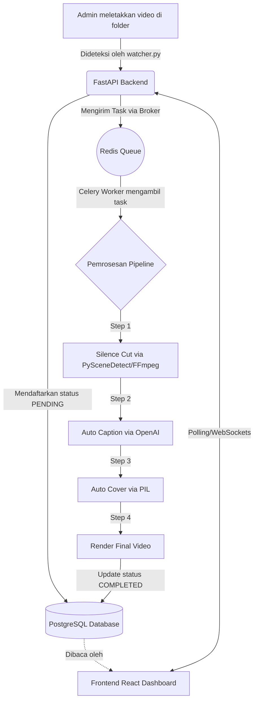

# 📈 Progress Proyek: Auto Video Editor

Dokumen ini melacak status pengembangan aplikasi **Auto Video Editor** berdasarkan PRD (*Product Requirements Document*).

## 📊 Status Keseluruhan
- **Fase Saat Ini:** Fase 1 (Core Pipeline & Silence Cut) - **Selesai (Backend Foundation)**
- **Fase Berikutnya:** Fase 2 (Auto Caption & Cover Generation)

---

## ✅ Pencapaian (Selesai)
- [x] Inisialisasi struktur *microservices* (Frontend Vite, Backend FastAPI).
- [x] Konfigurasi Docker Compose untuk PostgreSQL dan Redis.
- [x] Desain dan Migrasi Skema Database via SQLAlchemy.
- [x] Pembuatan integrasi Celery Worker untuk pemrosesan asinkron.
- [x] Script `watcher.py` untuk mendeteksi folder video baru secara otomatis.
- [x] Update penggunaan SDK **OpenAI gpt-4o-mini-transcribe** dan **PySceneDetect v0.6+**.
- [x] Pembuatan skrip Integration Test (`test_pipeline.py`) untuk memvalidasi aliran data.
- [x] Dokumentasi Lengkap (`README.md`).

---

## 🏗️ Dalam Pengerjaan (WIP) / Tertunda
- [ ] Implementasi UI Dashboard Frontend agar sepenuhnya tersambung dengan API Backend.
- [ ] Pengujian modul FFmpeg `silencedetect` secara nyata dengan file video berat.
- [ ] Pembuatan fungsi *burn-in* subtitle ke dalam video menggunakan FFmpeg.
- [ ] *Image generation* untuk cover video dinamis menggunakan PIL.

---

## 🗺️ Alur Aplikasi (Flowchart)

Berikut adalah diagram arsitektur dan alur pemrosesan video dari hulu ke hilir:

## 📝 Catatan Teknis
- **PostgreSQL** dialihkan ke port `5433` di dalam Docker untuk menghindari bentrok dengan servis lokal di WSL/Windows.
- Seluruh tugas *backend* dapat ditinjau melalui file logs pada Database (`job_logs`).
