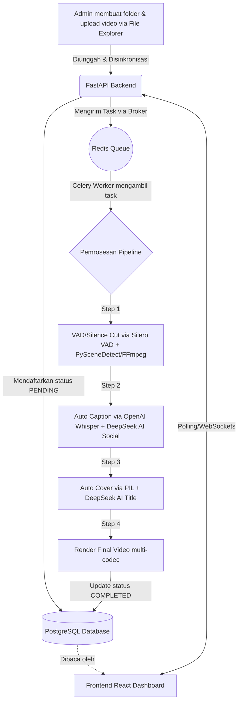

# 📈 Progress Proyek: Auto Video Editor

Dokumen ini melacak status pengembangan aplikasi **Auto Video Editor** berdasarkan PRD (*Product Requirements Document*).

## 📊 Status Keseluruhan
- **Fase Saat Ini:** Fase 5 (Testing & Enhancement) - **Selesai (MVP+ Lokal Siap Produksi)**
- **Fase Berikutnya:** Fase 6 (Migrasi Server Online)

---

## ✅ Pencapaian (Selesai)

### Fase 0–2: Setup & Core Pipeline
- [x] Inisialisasi struktur *microservices* (Frontend Vite, Backend FastAPI).
- [x] Desain dan Migrasi Skema Database via SQLAlchemy.
- [x] Pembuatan integrasi Celery Worker untuk pemrosesan asinkron.
- [x] Script `watcher.py` untuk mendeteksi folder video baru secara otomatis.
- [x] Update penggunaan SDK **OpenAI whisper-1** dan **PySceneDetect v0.6+**.
- [x] Keputusan Arsitektur: Resmi menggunakan **OpenAI API (`whisper-1`)** secara eksklusif sebagai penyedia tunggal layanan kecerdasan buatan (transkripsi / caption). Deepgram sepenuhnya dihapus dari ekosistem.
- [x] Pembuatan skrip Integration Test (`test_pipeline.py`) untuk memvalidasi aliran data.

### Fase 3–5: Auto Caption, Cover, Render & Dashboard
- [x] *Image generation* untuk cover video dinamis menggunakan PIL (4 template diimplementasikan).
- [x] Render multi-resolusi (720p, 1080p, 4K) dengan *aspect-ratio aware scaling* terintegrasi.
- [x] End-to-end integration test (`test_pipeline.py`) berjalan sukses dari Database → API → Celery Pipeline.
- [x] Pembuatan In-Browser File Explorer: Drag & drop, Context Menu, Multi-select, sinkronisasi otomatis ke Database, desain UI solid dan kompatibilitas sentuh (Mobile friendly).

### Stabilitas & Developer Experience (Juni 2026)
- [x] **Migrasi dari Docker ke Native Services:** PostgreSQL dan Redis sekarang berjalan sebagai service native WSL untuk performa lebih baik dan startup lebih cepat.
- [x] **One-Click Startup:** Pembuatan skrip `start-all.sh` dan `stop-all.sh` — satu perintah untuk menjalankan/mematikan PostgreSQL, Redis, Backend, Celery, dan Frontend.
- [x] **Windows Desktop Launcher:** File `.bat` di Desktop Windows (`Start Video Editor.bat` / `Stop Video Editor.bat`) — double-click untuk menjalankan semua service tanpa perlu buka terminal WSL manual.
- [x] **CORS Error Fix:** Menambahkan `CORSOnErrorMiddleware` untuk memastikan response HTTP 500 tetap menyertakan CORS headers — memperbaiki pesan "Network Error" yang tidak jelas di frontend.
- [x] **Error Handling Frontend:** Pesan error `handleSync` dan `submitCreateFolder` kini menampilkan detail yang lebih informatif (beda antara network error, server error, dan error spesifik).
- [x] **Pembersihan File Sampah:** Menghapus 6 file tidak terpakai (`docker-compose.yml`, `Tutorial Running.txt`, `frontend/README.md` boilerplate Vite, `PRD_claude II.md:Zone.Identifier` Windows ADS, `start.sh` lama, `stop.sh` lama).
- [x] **Dokumentasi Lengkap:** `README.md` diperbarui dengan tutorial terbaru (native services, start-all.sh, .bat launchers).

### AI & Pipeline Enhancement (Juni 2026)
- [x] **VAD/AI Speech Detection (Level 3):** Integrasi **Silero VAD** (PyTorch) untuk deteksi suara manusia vs noise. Suara kipas/bayi/kendaraan otomatis dibuang. Konfigurasi speech threshold dari dashboard.
- [x] **AI Social Media Caption:** Integrasi **DeepSeek V4 Flash** untuk mengubah transkrip mentah menjadi caption siap sosmed (dengan emoji, hashtag, dan 16 gaya bahasa). Generate on-demand dari halaman Hasil Render.
- [x] **AI Cover Title Generation:** Judul cover digenerate otomatis oleh DeepSeek dari transkrip. Auto line-wrap agar teks muat di gambar. 16 gaya bahasa + max kata configurable.
- [x] **Halaman Hasil Render:** Halaman baru `/outputs` — preview cover, tombol copy caption AI, download file, toggle upload sosmed, delete. Filter + pagination 20 data/halaman + video player pop-up.
- [x] **Render Multi-Codec:** Support H.264, H.265/HEVC, WebM. Konfigurasi codec dari dashboard (sebelumnya hardcode H.264).
- [x] **16 Gaya Bahasa:** Daftar gaya bahasa lengkap untuk caption AI & judul cover (Gen-Z, Hard Selling FOMO, Storytelling, Edukasi, Savage, ASMR, dll).
- [x] **Global Settings API Keys:** Halaman unified untuk OpenAI + DeepSeek API keys.
- [x] **DeepSeek Reasoning Fix:** Debug mode thinking/ reasoning DeepSeek V4 Flash yang menyebabkan output kosong — dinonaktifkan via `extra_body` parameter.

---

## 🏗️ Dalam Pengerjaan (WIP) / Tertunda
- [ ] Persiapan environment untuk migrasi VPS / Cloud Server Online (Fase 6).

---

## 🗺️ Alur Aplikasi (Flowchart)

## 📝 Catatan Teknis

- **PostgreSQL** native WSL port **5432**. Start: `sudo pg_ctlcluster 18 main start`.
- **Redis** native WSL port **6379**. Start: `sudo service redis-server start`.
- **Frontend Vite** port **5173**, **Backend FastAPI** port **8000**.
- **One-click startup:** `./start-all.sh` (WSL) atau double-click `Start Video Editor.bat` (Windows Desktop).
- **Celery tidak auto-reload.** Setiap perubahan kode Python di backend, restart Celery.
- **DeepSeek V4 Flash** — OpenAI-compatible, reasoning mode harus dinonaktifkan (`extra_body={"thinking": {"type": "disabled"}}`).
- **Silero VAD** — 1.6MB model, CPU-only via PyTorch. Akurasi >90% deteksi suara manusia vs noise.
- Logs: `logs/backend.log`, `logs/frontend.log`, `logs/celery.log`.
- DB logs: tabel `job_logs` untuk tracking per-step pipeline.
