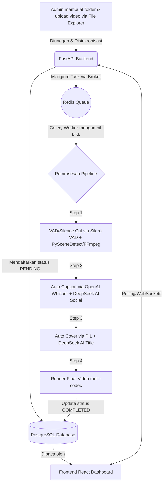

# 📈 Progress Proyek: Vidflow Studio

Dokumen ini melacak status pengembangan aplikasi **Vidflow Studio** berdasarkan PRD (*Product Requirements Document*).

## 📊 Status Keseluruhan
- **Fase Saat Ini:** Fase 6 (Migrasi Server Online) - **Selesai (Production Ready)**
- **Fase Berikutnya:** Maintenance & Scaling

---

## ✅ Pencapaian (Selesai)

### Fase 0–2: Setup & Core Pipeline
- [x] Inisialisasi struktur *microservices* (Frontend Vite, Backend FastAPI).
- [x] Desain dan Migrasi Skema Database via SQLAlchemy.
- [x] Pembuatan integrasi Celery Worker untuk pemrosesan asinkron.
- [x] Script `watcher.py` untuk mendeteksi folder video baru secara otomatis.
- [x] Update penggunaan SDK **OpenAI whisper-1** dan **PySceneDetect v0.6+**.
- [x] Keputusan Arsitektur: Resmi menggunakan **OpenAI API (`whisper-1`)** secara eksklusif sebagai penyedia tunggal layanan kecerdasan buatan (transkripsi / caption). Deepgram sepenuhnya dihapus dari ekosistem.
- [x] Pembuatan skrip Integration Test (`test_pipeline.py`) untuk memvalidasi aliran data.

### Fase 3–5: Auto Caption, Cover, Render & Dashboard
- [x] *Image generation* untuk cover video dinamis menggunakan PIL (3 template dual-color diimplementasikan).
- [x] Render multi-resolusi (720p, 1080p, 4K) dengan *aspect-ratio aware scaling* terintegrasi.
- [x] End-to-end integration test (`test_pipeline.py`) berjalan sukses dari Database → API → Celery Pipeline.
- [x] Pembuatan In-Browser File Explorer: Drag & drop, Context Menu, Multi-select, sinkronisasi otomatis ke Database, desain UI solid dan kompatibilitas sentuh (Mobile friendly).

### Stabilitas & Developer Experience (Juni 2026)
- [x] **Migrasi dari Docker ke Native Services:** PostgreSQL dan Redis sekarang berjalan sebagai service native WSL untuk performa lebih baik dan startup lebih cepat.
- [x] **One-Click Startup:** Pembuatan skrip `start-all.sh` dan `stop-all.sh` — satu perintah untuk menjalankan/mematikan PostgreSQL, Redis, Backend, Celery, dan Frontend.
- [x] **Windows Desktop Launcher:** File `.bat` di Desktop Windows (`Start Vidflow Studio.bat` / `Stop Vidflow Studio.bat`) — double-click untuk menjalankan semua service tanpa perlu buka terminal WSL manual.
- [x] **CORS Error Fix:** Menambahkan `CORSOnErrorMiddleware` untuk memastikan response HTTP 500 tetap menyertakan CORS headers — memperbaiki pesan "Network Error" yang tidak jelas di frontend.
- [x] **Error Handling Frontend:** Pesan error `handleSync` dan `submitCreateFolder` kini menampilkan detail yang lebih informatif (beda antara network error, server error, dan error spesifik).
- [x] **Pembersihan File Sampah:** Menghapus 6 file tidak terpakai (`docker-compose.yml`, `Tutorial Running.txt`, `frontend/README.md` boilerplate Vite, `PRD_claude II.md:Zone.Identifier` Windows ADS, `start.sh` lama, `stop.sh` lama).
- [x] **Dokumentasi Lengkap:** `README.md` diperbarui dengan tutorial terbaru (native services, start-all.sh, .bat launchers).

### AI & Pipeline Enhancement (Juni 2026)
- [x] **VAD/AI Speech Detection (Level 3):** Integrasi **Silero VAD** (PyTorch) untuk deteksi suara manusia vs noise.
- [x] **AI Social Media Caption:** DeepSeek V4 Flash — caption siap sosmed dengan emoji, hashtag, 16 gaya bahasa.
- [x] **AI Cover Title Generation:** Judul cover oleh DeepSeek dari transkrip. Auto line-wrap.
- [x] **Halaman Hasil Render:** Preview, copy caption AI, download, toggle upload, delete. Pagination + video player.
- [x] **Render Multi-Codec:** H.264, H.265/HEVC, WebM.
- [x] **16 Gaya Bahasa:** Gen-Z, Hard Selling, Storytelling, Edukasi, Savage, ASMR, dll.
- [x] **Global Settings API Keys:** OpenAI + DeepSeek unified.

### UI/UX & Pipeline Enhancement (Juni 2026 — Sesi 2)
- [x] **Sequential Processing:** Celery `--concurrency=1` + `prefetch_multiplier=1` — video diproses satu per satu agar tidak overload laptop.
- [x] **Product Group (Kelola Produk):** Model `ProductGroup` — folder source dipetakan ke nama produk. AI caption & cover pakai konteks produk sebagai fokus utama (bukan sekadar transkrip).
- [x] **Multi-File Upload:** Drag & drop banyak file sekaligus di File Explorer + progress toast per file.
- [x] **Styled Delete Modal:** Konfirmasi hapus di File Explorer pakai glass-panel overlay (tidak lagi `confirm()` browser).
- [x] **Global Text Overflow Fix:** CSS `word-break` di semua elemen — teks panjang tidak out dari box.
- [x] **Batch Render:** Checkbox select-all + tombol "Render N Video" di Daftar Video.
- [x] **3 New Cover Templates:** `tpl_new_1` (Kuning-Putih), `tpl_new_2` (Hijau-Putih), `tpl_new_3` (Merah-Putih) — dual-color, 25 karakter/baris, posisi 35% dari bawah. Template lama (`grad_1–5`) dihapus.
- [x] **Auto-Font Fix:** Font cover sekarang adaptif ke resolusi + panjang teks — tidak lagi out-of-frame.
- [x] **Cover Config Update:** Slider maksimum kata judul 3–12 (default 7).
- [x] **Cancel Processing:** Tombol Stop (⏹) untuk batalkan pipeline yang sedang berjalan — status `CANCELLED`.
- [x] **Video Detail Modal:** Tombol `...` sekarang menampilkan detail video + riwayat job log per step.
- [x] **Bug Fixes:** Delete endpoint (path converter), sync 500 error, DB column migration (`celery_task_id`, enum `CANCELLED`), output file matching, empty folder cleanup.

### Fase 6: Migrasi Server Online (Juni 2026)
- [x] **Dockerize Semua Service:** `docker-compose.yml` + Dockerfile untuk Backend, Celery, Nginx.
- [x] **Setup VPS IDCloudHost:** Ubuntu 24.04, 4 Core, 8GB RAM.
- [x] **Deploy ke Production:** `https://app.muhirastore.com` dengan Nginx reverse proxy.
- [x] **HTTPS/SSL:** Let's Encrypt via Certbot, auto-renew cron.
- [x] **Firewall UFW:** Port 22, 80, 443 only.
- [x] **JWT Authentication:** Login page + token-based API protection.
- [x] **Path Configuration:** Module `paths.py` terpusat — APP_HOME env var.
- [x] **Portrait Video Render Fix:** Orientasi vertikal auto-detect, output 1080×1920.
- [x] **WAITING Queue:** Batch render auto-antri, sequential processing.
- [x] **Folder Comment:** Label/komentar per folder di File Explorer.
- [x] **Move File:** Pindahkan file video antar folder (context menu).
- [x] **Delete Product Group:** Hapus grup produk tanpa hapus folder.
- [x] **Upload Progress Bar:** Persentase + kecepatan upload real-time.
- [x] **Download X-Accel-Redirect:** Nginx serve file langsung, 145x lebih cepat.
- [x] **FFmpeg Optimization:** preset fast + CRF 18, render 2x lebih cepat.
- [x] **Mobile UI Upgrade:** Responsive design, bottom nav bar, touch-friendly.
- [x] **Mobile Access Tutorial:** Port forwarding WSL → akses dari HP via WiFi.
- [x] **Dashboard Enhancement:** Recent Jobs 15 entri, hapus log, bersihkan riwayat.
- [x] **Database Migration:** Export/import lokal → server via pg_dump.
- [x] **Credential Security:** Password rotation, .env gitignored, Migrasi.md disensor.

---

## 🏗️ Dalam Pengerjaan (WIP) / Tertunda
- [ ] Auto-deploy via GitHub Actions (CI/CD).
- [ ] Backup database otomatis ke cloud storage.
- [ ] Monitoring production (Uptime Kuma).
- [ ] CDN untuk file output (opsional).

---

## 🗺️ Alur Aplikasi (Flowchart)

## 📝 Catatan Teknis

- **PostgreSQL** native WSL port **5432**. Start: `sudo pg_ctlcluster 18 main start`.
- **Redis** native WSL port **6379**. Start: `sudo service redis-server start`.
- **Frontend Vite** port **5173**, **Backend FastAPI** port **8000**.
- **One-click startup:** `./start-all.sh` (WSL) atau double-click `Start Vidflow Studio.bat` (Windows Desktop).
- **Celery tidak auto-reload.** Setiap perubahan kode Python di backend, restart Celery.
- **DeepSeek V4 Flash** — OpenAI-compatible, reasoning mode harus dinonaktifkan (`extra_body={"thinking": {"type": "disabled"}}`).
- **Silero VAD** — 1.6MB model, CPU-only via PyTorch. Akurasi >90% deteksi suara manusia vs noise.
- **Production URL:** `https://app.muhirastore.com` (HTTPS, Nginx reverse proxy).
- **SSH Server:** `ssh kangdemuh@103.59.94.188` (VPS IDCloudHost Ubuntu 24.04).
- **Deploy:** `git pull && docker compose up -d --build`.
- Logs: `logs/backend.log`, `logs/frontend.log`, `logs/celery.log`.
- DB logs: tabel `job_logs` untuk tracking per-step pipeline.
- **Mobile Access:** Port forwarding WSL ke Windows → akses dari HP via WiFi.
